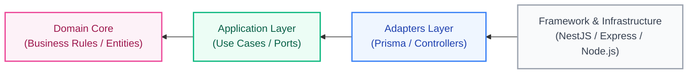
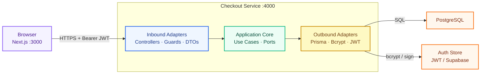
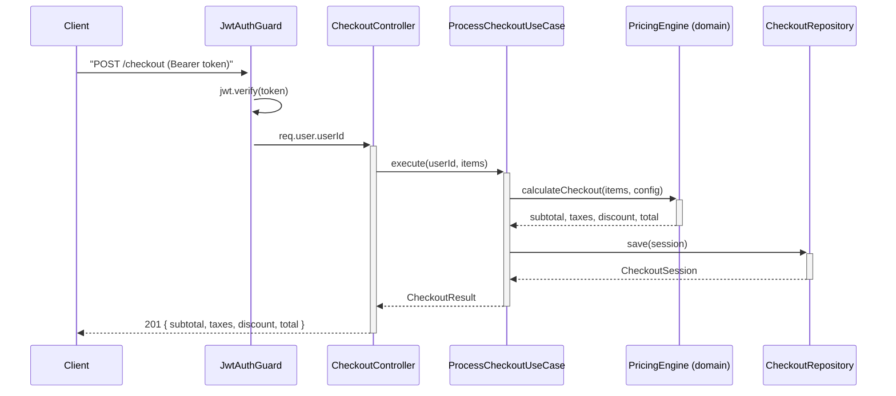
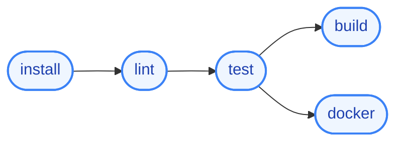
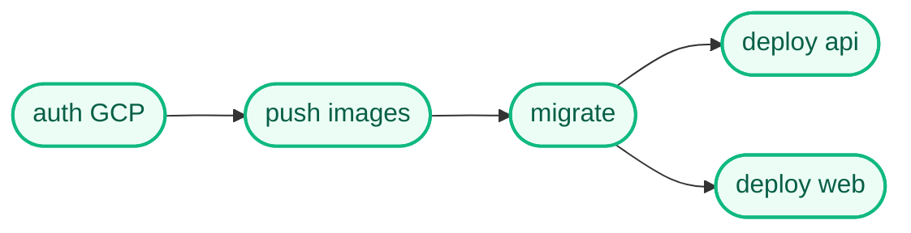

# Checkout Service

A stateless NestJS microservice that calculates checkout totals, persists sessions, and authenticates requests via JWT. Includes a bonus Next.js UI. Deployable to Railway, AWS ECS, or GCP Cloud Run by changing environment variables only.

## Architecture

Hexagonal (Ports & Adapters). The business core has zero dependencies on any framework or infrastructure library.



- `core/domain` — pure entities and pricing functions
- `core/ports` — interface contracts (no implementation)
- `core/application` — use cases; orchestrates domain + ports
- `adapters/in/http` — controllers, guards, DTOs
- `adapters/out/db` — PostgreSQL / DynamoDB / MongoDB
- `adapters/out/auth` — JWT / Auth0 / Cognito / Firebase

### End-to-End Request Flow



## API

### Checkout request lifecycle



### POST /auth/login
```json
// request
{ "email": "user@example.com", "password": "secret" }

// 200
{ "access_token": "eyJ...", "expires_in": 3600 }
```

### POST /checkout
Requires `Authorization: Bearer <token>`.

```json
// request
{ "items": [{ "name": "Widget A", "unit_price": 49.99, "quantity": 2 }] }

// 201
{ "subtotal": 99.98, "taxes": 13.00, "discount": 0.00, "total": 112.98 }
```

Pricing rules:
- `subtotal` = Σ (unit_price × quantity)
- `taxes` = subtotal × 0.13
- `discount` = subtotal > 100 → subtotal × 0.10, else 0
- `total` = subtotal + taxes − discount

### GET /health
```json
// 200
{ "status": "ok", "timestamp": "2026-05-30T00:00:00.000Z" }
```

## Getting Started

### Prerequisites

- [Docker](https://docs.docker.com/get-docker/) and Docker Compose
- [Node.js](https://nodejs.org/) 20+ and [pnpm](https://pnpm.io/) (for local development)

### Run with Docker (full stack)

```bash
docker compose up
```

API → `http://localhost:4000`  
Web UI → `http://localhost:3000`

> `docker-compose.yml` injects all env vars directly — no `.env` file needed.

### Run locally (monorepo)

```bash
pnpm install
pnpm setup          # copies *.env.example → .env for each app
pnpm dev            # starts api + web via turbo
```

`pnpm setup` is a one-time step. Edit the generated files before running if you want real Postgres or JWT auth (defaults use mock adapters so no database is required).

### Run a single app — from its directory

```bash
cd apps/api && pnpm dev   # reads apps/api/.env
cd apps/web && pnpm dev   # reads apps/web/.env.local
```

### Run a single app — from the monorepo root

Use turbo's `--filter` flag to target a specific package without changing directory:

```bash
pnpm dev --filter=@checkout/api     # API only
pnpm dev --filter=@checkout/web     # Web only
```

You can also combine filters or use them with other tasks:

```bash
pnpm dev --filter=@checkout/api --filter=@checkout/web   # explicit — same as pnpm dev
pnpm build --filter=@checkout/api                        # build only the API
pnpm test --filter=@checkout/api                         # test only the API
```

> Package names come from each app's `package.json` `"name"` field.

## Environment Variables

Each app owns its own env file. See the committed examples for all available options.

**`apps/api/.env.example`** — API service

| Variable | Default | Description |
|----------|---------|-------------|
| `DATABASE_URL` | — | PostgreSQL connection string |
| `JWT_SECRET` | — | HS256 signing secret (min 32 chars) |
| `DB_PROVIDER` | `postgres` | `postgres` \| `mock` |
| `AUTH_PROVIDER` | `jwt` | `jwt` \| `mock` |
| `DB_SSL` | `false` | Enable TLS for database connection |
| `SHELL_ORIGIN` | — | CORS allowed origin (web app URL) |
| `PORT` | `4000` | API listen port |

**`apps/web/.env.local.example`** — Web service

| Variable | Default | Description |
|----------|---------|-------------|
| `NEXT_PUBLIC_API_URL` | `http://localhost:4000` | API base URL |

Never commit `.env` or `.env.local` files. Inject secrets at runtime in production.

## Project Structure

```
apps/
  api/           NestJS backend
    src/
      core/
        domain/         Entities + pricing engine (zero deps)
        ports/          Interface contracts
        application/    Use cases
      adapters/
        in/http/        Controllers, guards, DTOs
        out/db/         Database adapters
        out/auth/       Auth adapters
    prisma/             Schema + migrations
  web/           Next.js frontend (bonus)
agents/          Sub-agent role definitions
docs/            Architecture and requirements docs
```

## Docs

| Document | Purpose |
|----------|---------|
| [docs/SAD-001](docs/SAD-001-checkout-service.md) | Software Architecture Document |
| [docs/ADR-001](docs/ADR-001-checkout-service.md) | Architectural Decision Record |
| [docs/SRS-001](docs/SRS-001-checkout-service.md) | Software Requirements Specification |
| [docs/AUTH](docs/AUTH.md) | Authentication details and custom session scopes |
| [docs/DEPLOY](docs/DEPLOY.md) | Multi-cloud deployment instructions (Railway, AWS, GCP) |
| [docs/REQUIREMENTS-AUDIT](docs/REQUIREMENTS-AUDIT.md) | Feature-to-code trace and requirement audit |

## Testing

```bash
pnpm turbo test
```

`pricing.engine.ts` has 100% unit test coverage. Integration tests hit a real database — no mocks.

## CI / CD

### CI Pipeline (`.github/workflows/ci.yml`)

Triggered on every push to `main`. Stages run in order and tests must pass before any build artifact is produced.



| Stage | What it does |
|-------|-------------|
| **install** | `pnpm install --frozen-lockfile`, saves `node_modules` to cache |
| **lint** | TypeScript type-check (`tsc --noEmit`) via `@checkout/api` |
| **test** | `pnpm --filter @checkout/api test` — runs the full Jest suite (unit + integration). Uses mock adapters; no real database needed. |
| **build** | Compiles API (`tsc`) and builds the Next.js web app. Runs only after lint + test pass. |
| **docker** | Builds the API image with Docker Buildx (layer cache backed by GitHub Actions cache), then runs a live smoke test: starts the container with mock adapters and hits `GET /health`. |

The smoke test step starts the real Docker image and retries `curl` five times before marking the build green — a broken image cannot pass CI.

### CD Pipeline (`.github/workflows/cd.yml`)

Triggered by `workflow_run` on CI **completing successfully** — CD never starts if CI fails or is skipped. Deploys to **GCP Cloud Run** using Workload Identity Federation (no long-lived credentials stored as secrets).



| Step | Detail |
|------|--------|
| **Authenticate** | Keyless auth via `google-github-actions/auth` + Workload Identity Federation |
| **Push images** | Tags both `api` and `web` images with the Git SHA and pushes to Artifact Registry |
| **Migrate** | Runs `prisma migrate deploy` as a one-off Cloud Run Job — migrations complete before the new revision receives traffic |
| **Deploy** | Rolls out `checkout-api` and `checkout-web` Cloud Run services in the configured region |

#### Required GitHub secrets

| Secret | Description |
|--------|-------------|
| `GCP_WORKLOAD_IDENTITY_PROVIDER` | Full Workload Identity Provider resource name |
| `GCP_SERVICE_ACCOUNT` | Service account email used by the pipeline |
| `GCP_PROJECT_ID` | GCP project ID |
| `GCP_REGION` | Region, e.g. `us-central1` |
| `checkout-database-url` | Secret Manager secret name for the production `DATABASE_URL` |

### Docker images

Both Dockerfiles are **multi-stage** and pin `node:20-alpine`. The final runner image contains only production dependencies and the compiled output — no dev tooling is baked in. All containers run as a non-root `app` user and expose a `HEALTHCHECK` on `/health`.

The `migrate` service in `docker-compose.yml` runs `prisma migrate deploy` in a separate container before the API starts. The `api` service waits for `migrate: condition: service_completed_successfully`, so migrations always run before the application accepts traffic — locally and in production.

### Deploy targets

Switch targets by changing environment variables only — zero code changes required.

| Layer | Local | MVP | AWS | GCP |
|-------|-------|-----|-----|-----|
| API | Docker Compose | Railway | ECS Fargate | Cloud Run |
| DB | Postgres container | Supabase | RDS | Supabase |
| Frontend | Docker Compose | Vercel | CloudFront | Cloud Run |
