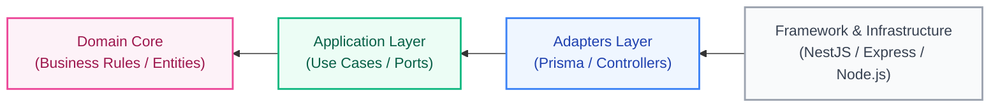
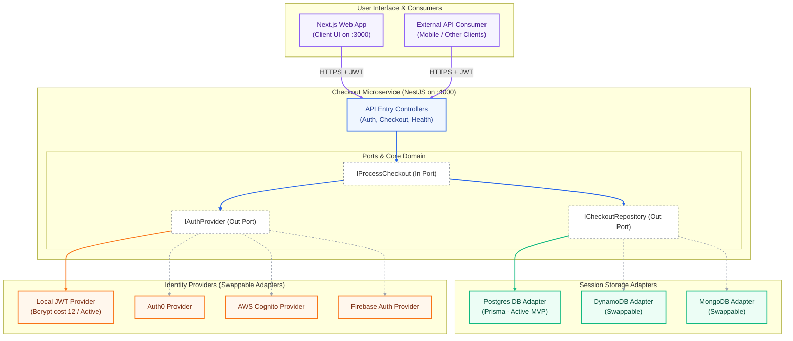
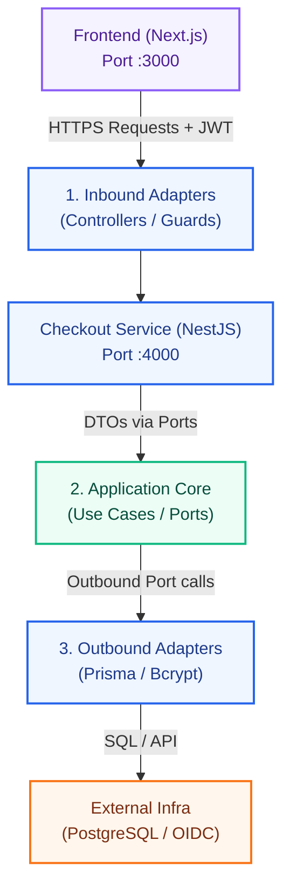
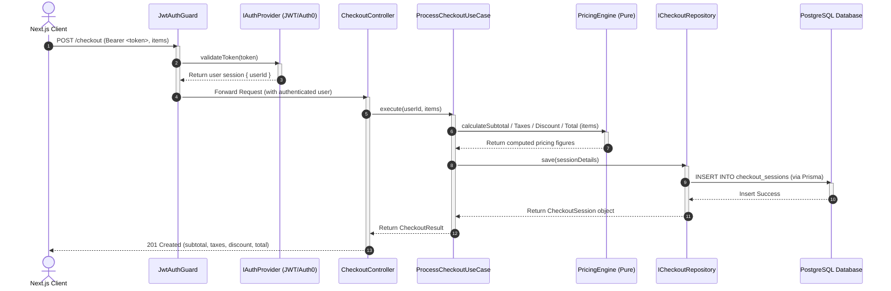
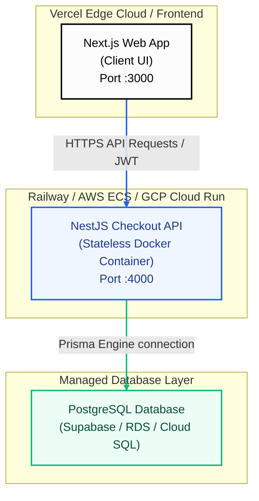
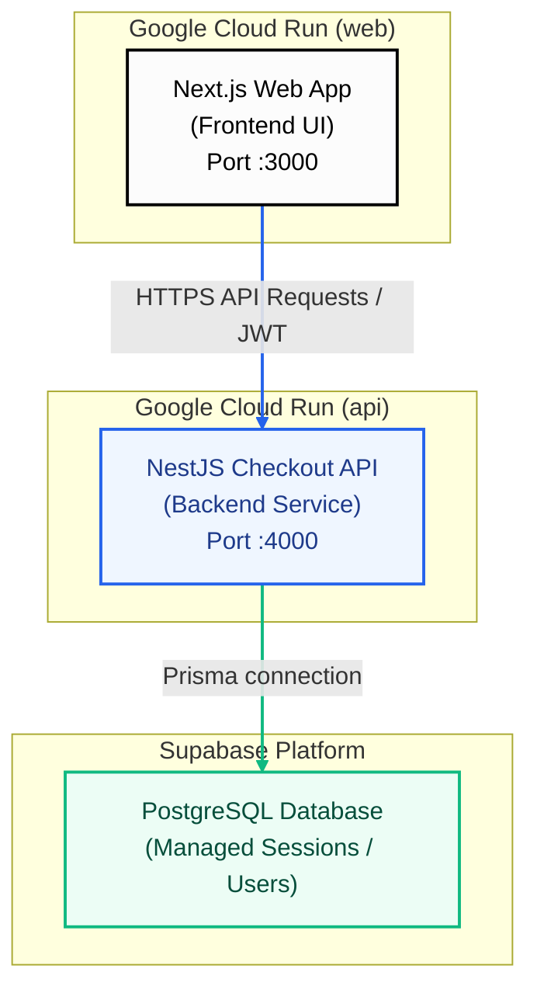

# SAD-001: Software Architecture Document
## Simple Checkout Service

| Field       | Detail      |
|-------------|-------------|
| **Version** | 1.0.0       |
| **Status**  | Approved    |
| **Date**    | 2026-05-30  |
| **References** | ADR-001, SRS-001 |

---

## 1. Overview

The checkout service is a stateless NestJS microservice that calculates checkout totals, persists sessions, and authenticates requests via JWT. A Next.js web app provides a bonus UI. Both are packaged as Docker images and deployable to Railway (MVP), AWS, or GCP by changing environment variables only.

---

## 2. Architectural Style

**Hexagonal Architecture (Ports & Adapters).**

The business core has zero dependencies on any framework or infrastructure library. All I/O crosses a port interface. Adapters implement ports and are swapped via env vars — no code changes required to change the database or auth provider.

Dependency rule: arrows always point inward toward the business core.



The core (`Domain` & `Application`) is contained at the center and has zero coupling to infrastructure (Database, Web Framework, Auth Providers). Communication with the external world is exclusively done through defined contracts (**Ports**). Any external system implements these contracts through pluggable modules (**Adapters**).

---

## 3. System Context



### 3.1 End-to-End Connection Mechanics

The Frontend and External Adapters connect through a structured multi-layer pipeline:



1. **Frontend to Inbound HTTP Adapters**: Next.js client sends HTTPS requests to the controllers. Protected routes contain a `Bearer <token>` HTTP header.
2. **Inbound Adapters to Core Ports**: Controllers & Guards validate authentication (calling `validateToken` on the Auth Port) and then pass DTOs into the Application Core through inbound Port interfaces (`IProcessCheckout`).
3. **Core to Outbound Adapters**: The use case processes the business logic and calls outbound Ports (`ICheckoutRepository` / `IAuthProvider`) to save data or verify credentials.
4. **Outbound Adapters to External Infrastructure**: Active DB adapters query the database (e.g., Prisma querying PostgreSQL), and Auth adapters connect to local database tables or external OIDC providers.

---

## 4. Layer Structure

```
apps/api/src/
├── core/
│   ├── domain/
│   │   ├── checkout.ts              ← CheckoutItem, CheckoutSession, CheckoutResult
│   │   └── pricing.engine.ts        ← pure pricing functions
│   ├── ports/
│   │   ├── in/
│   │   │   └── checkout.usecase.port.ts    ← IProcessCheckout
│   │   └── out/
│   │       ├── checkout.repo.port.ts       ← ICheckoutRepository
│   │       └── auth.provider.port.ts       ← IAuthProvider
│   └── application/
│       └── process-checkout.usecase.ts
│
└── adapters/
    ├── in/http/
    │   ├── checkout.controller.ts
    │   ├── auth.controller.ts
    │   ├── health.controller.ts
    │   ├── checkout.dto.ts
    │   └── jwt-auth.guard.ts
    └── out/
        ├── db/
        │   ├── postgres/
        │   ├── dynamo/
        │   └── mongo/
        └── auth/
            ├── jwt/
            ├── auth0/
            ├── cognito/
            └── firebase/
```

---

## 5. Component Descriptions

### 5.1 Domain (`core/domain`)

Pure TypeScript — no imports, no side effects.

`pricing.engine.ts` exposes three pure functions:

```
calculateSubtotal(items)  → number
calculateTaxes(subtotal)  → number  [subtotal × 0.13]
calculateDiscount(subtotal) → number  [subtotal × 0.10 if subtotal > 100, else 0]
calculateTotal(subtotal, taxes, discount) → number
```

All values rounded to 2 decimal places via `Math.round(value * 100) / 100`.

### 5.2 Ports (`core/ports`)

Interfaces only — no implementation.

| Port | Direction | Consumer |
|------|-----------|---------|
| `IProcessCheckout` | Inbound | HTTP controller calls it |
| `ICheckoutRepository` | Outbound | Use case calls it |
| `IAuthProvider` | Outbound | Use case + Guard call it |

### 5.3 Use Case (`core/application`)

`ProcessCheckoutUseCase` implements `IProcessCheckout`:
1. Calls `pricing.engine.ts` to compute all fields.
2. Calls `ICheckoutRepository.save()` to persist the session.
3. Returns `CheckoutResult`.

It knows nothing about HTTP, databases, or auth tokens.

### 5.4 HTTP Adapter (`adapters/in/http`)

- `JwtAuthGuard` extracts the Bearer token and calls `IAuthProvider.validateToken()`. Attaches `{ userId }` to the request.
- `AuthController` calls `IAuthProvider.verifyCredentials()` and `issueToken()`.
- `CheckoutController` calls `IProcessCheckout.execute()` with the validated user ID and DTO items.
- Global `ValidationPipe` (`whitelist: true`) handles all input validation via class-validator decorators.
- Global exception filter normalizes errors — no stack traces to clients.

### 5.5 DB Adapters (`adapters/out/db`)

Each implements `ICheckoutRepository.save()`. Active adapter selected at startup:

```typescript
const DB_ADAPTER = { postgres, dynamo, mongo }[process.env.DB_PROVIDER ?? 'postgres'];
```

The Postgres adapter uses **Prisma** (`PrismaService` wraps `PrismaClient`). `items` stored as `JSONB`. Records are insert-only. Schema lives in `apps/api/prisma/schema.prisma`.

### 5.6 Auth Adapters (`adapters/out/auth`)

Each implements `IAuthProvider`. Active adapter selected at startup:

```typescript
const AUTH_ADAPTER = { jwt, auth0, cognito, firebase }[process.env.AUTH_PROVIDER ?? 'jwt'];
```

The JWT adapter stores users in PostgreSQL, hashes passwords with bcrypt (cost 12), and signs HS256 tokens. Other adapters validate tokens against external JWKS endpoints.

### 5.7 Frontend (`apps/web`)

Next.js App Router single application. Two routes:
- `/login` — calls `POST /auth/login`, stores token in React state (memory only).
- `/checkout` — protected; renders item form, calls `POST /checkout`, displays result.

---

## 6. Request Flow

### POST /checkout



---

## 7. Data Model

The database schema is declaratively defined via the Prisma Schema (`prisma/schema.prisma`). It consists of a single immutable table, as authentication and user records are delegated to pluggable identity systems (like Supabase Auth or mock providers).

### 7.1 Prisma Schema (`prisma/schema.prisma`)

```prisma
model CheckoutSession {
  id         String   @id @default(uuid()) @db.Uuid
  user_id    String
  items      Json
  subtotal   Decimal  @db.Decimal(12, 2)
  taxes      Decimal  @db.Decimal(12, 2)
  discount   Decimal  @db.Decimal(12, 2)
  total      Decimal  @db.Decimal(12, 2)
  created_at DateTime @default(now()) @db.Timestamptz

  @@map("checkout_sessions")
}
```

### 7.2 SQL Database Schema

```sql
CREATE TABLE checkout_sessions (
  id         UUID PRIMARY KEY DEFAULT gen_random_uuid(),
  user_id    VARCHAR(255) NOT NULL, -- Managed by external Auth providers
  items      JSONB NOT NULL,        -- [{ name, unit_price, quantity }]
  subtotal   NUMERIC(12,2) NOT NULL,
  taxes      NUMERIC(12,2) NOT NULL,
  discount   NUMERIC(12,2) NOT NULL,
  total      NUMERIC(12,2) NOT NULL,
  created_at TIMESTAMPTZ DEFAULT now()
);
```

`checkout_sessions` is immutable — no UPDATE or DELETE.

---

## 8. Deployment View

### 8.1 General MVP & Multi-Cloud Deployment

The general multi-cloud target hosts the frontend on Vercel and the backend container on a microservice host:



### 8.2 GCP Production Deployment (Terraform)

When deploying to Google Cloud Platform, the configuration uses containerized services on **Google Cloud Run** for both layers, combined with **Supabase** for fully managed PostgreSQL data and Authentication:



All secrets are securely fetched from **Google Secret Manager** at startup. Switch targets by changing environment variables only — zero code changes required.

---

## 9. Key Architecture Decisions

| Decision | Choice | Alternative rejected |
|----------|--------|----------------------|
| Framework | NestJS | Fastify (no native DI) |
| Architecture | Hexagonal | Clean Architecture (weaker port isolation) |
| ORM | Prisma | TypeORM (removed: unsafe synchronize, decorator coupling) |
| Database | PostgreSQL + JSONB | MongoDB (unnecessary for MVP) |
| Auth | Swappable adapter | Hardcoded JWT |
| Frontend | Next.js single app | Webpack Module Federation MFE (too complex for MVP) |
| Monorepo | Turborepo | Separate repos (harder to share types) |

---

## 10. Extension Points

| Change | Impact |
|--------|--------|
| New pricing rule (regional tax, promo code) | Modify `pricing.engine.ts` only |
| New database | Add adapter in `adapters/out/db/`, set `DB_PROVIDER` |
| New auth provider | Add adapter in `adapters/out/auth/`, set `AUTH_PROVIDER` |
| New cloud target | New Dockerfile / infra config, zero app code changes |
| Extract to microservices | NestJS modules → independent services; ports define the contracts |
